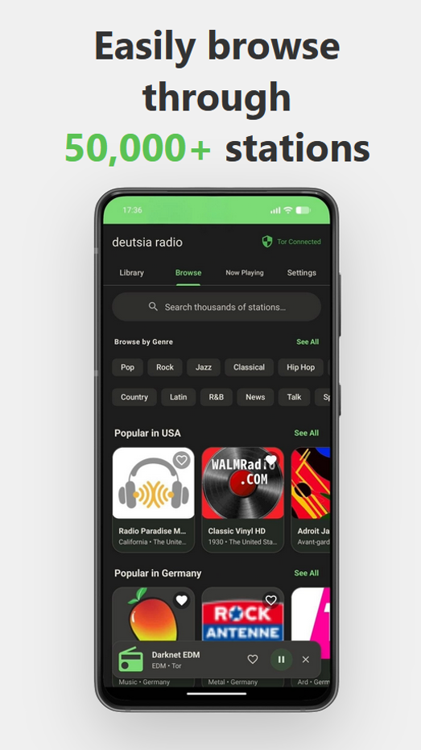
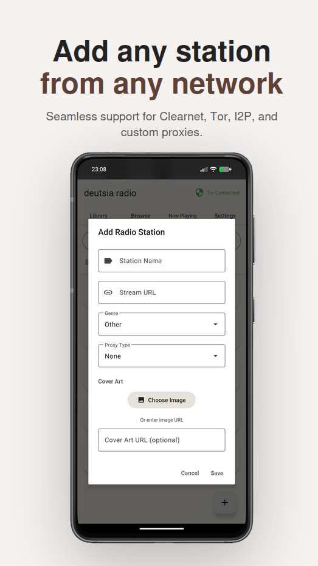

<div align="center">


<br></br>

#  deutsia radio
Privacy-focused, anti-censorship multinet radio player with Material You.

[](https://github.com/deutsia/deutsia-radio/releases/latest) &nbsp; [](https://github.com/ImranR98/Obtainium)

---

</div>

<div align="center">
    
    
    
</div>

---

## Updates
- **New Release: v1.4.1** Fixed disable decryption bug
---

## Features
- **Multinet Support** - Clearnet, I2P (.i2p), and Tor (.onion)
- **Force Tor Modes** - Proxy-or-fail enforcement with instant leak prevention
- **50,000+ Stations** - Access RadioBrowser API or add custom streams
- **Material You** - Dynamic theming along with 6 color schemes
- **Stream Recording** - Record across multiple stations
- **App Lock** - Secure your listening with biometric/PIN protection and optional database encrpytion 
- **17 Languages** - Multilingual interface support
- **Light/Dark/System** - Adaptive theme modes

---

## Privacy & Security

**Optional Database Encryption** via SQLCipher:
- All local data encrypted at rest (stations, settings, history)
- App lock with biometric/PIN protection
- Secure storage for favorites and playback data

**Credential Protection** via Android Jetpack Security:
- Proxy passwords encrypted with AES-256-GCM
- Hardware-backed encryption keys (when available)
- Secure credential storage for custom proxy authentication

**Tor Integration** via InviZible Pro SOCKS5 proxy:
- Instant disconnect detection (< 100ms)
- Fail-safe proxy enforcement - no clearnet fallback
- Automatic stream termination on proxy changes

**Force Tor Modes:**
- **Force Tor All** - Route everything through Tor
- **Force Tor Except I2P** - Tor for clearnet, I2P proxy for .i2p domains

**I2P Integration** via HTTP proxy (port 4444):
- Seamless .i2p domain routing
- Compatible with official I2P Android app

**Custom Proxies**
- Support for Digest and Basic auth
- Support for SOCKS4, SOCKS5, HTTP, and HTTPS proxies

---

## Requirements
- Android 7.0 (API 24) or higher
- **For Tor:** [InviZible Pro](https://invizible.net) - Use **proxy mode** (not VPN mode) for best compatibility (click on the three dot menu in the upper right hand corner to switch). Proxy mode is easy to configure and allows running a separate VPN in the background if desired. Using Tor as a full device VPN will make I2P streaming almost impossible due to its latency.
- **For I2P:** [I2P Android](https://geti2p.net/en/download) or [InviZible Pro](https://invizible.net) via i2pd

---

## Tech Stack
- Kotlin + Material Design 3
- ExoPlayer (Media3) for audio
- OkHttp with SOCKS/HTTP proxy support
- Coil for proxy-aware image loading

---

## Building

```bash
git clone https://github.com/deutsia/deutsia-radio.git
cd deutsia-radio
./gradlew assembleDebug
```

APK output: `app/build/outputs/apk/debug/`

---

## Submit Stations

You can submit darknet stations (I2P/Tor) to be added to the bundled JSON list in the app by opening an issue, creating a pull request with the added stations, or by emailing me at **bb7x89uo at anonaddy dot me**.

Please do **not** submit clearnet stations here, even if they are part of a darknet website. If the stream source is not `.i2p` or `.onion`, please submit it to the [RadioBrowser database](https://www.radio-browser.info/add) instead.

---

## Support Development

**Monero (XMR):**
```
83GGx86c6ZePiz8tEcGYtGJYmnjuP8W9cfLx6s98WAu8YkenjLr4zFC4RxcCk3hwFUiv59wS8KRPzNUUUqTrrYXCJAk4nrN
```

---

##  Acknowledgments
- [RadioBrowser](https://www.radio-browser.info/) - Station database
- [InviZible Pro](https://invizible.net) - Tor/DNSCrypt/I2P integration
- [I2P Project](https://geti2p.net/) - Anonymous networking on Android
- Built with [Claude Code](https://github.com/anthropics/claude-code)
- [SQLCipher](https://www.zetetic.net/sqlcipher/) - Database encryption
---

## License

    deutsia radio

    Copyright (c) 2024 deutsia

    Licensed under the Apache License, Version 2.0 (the "License");
    you may not use this file except in compliance with the License.
    You may obtain a copy of the License at

        http://www.apache.org/licenses/LICENSE-2.0

    Unless required by applicable law or agreed to in writing, software
    distributed under the License is distributed on an "AS IS" BASIS,
    WITHOUT WARRANTIES OR CONDITIONS OF ANY KIND, either express or implied.
    See the License for the specific language governing permissions and
    limitations under the License.

---

<div align="center">
    
    
</div>
