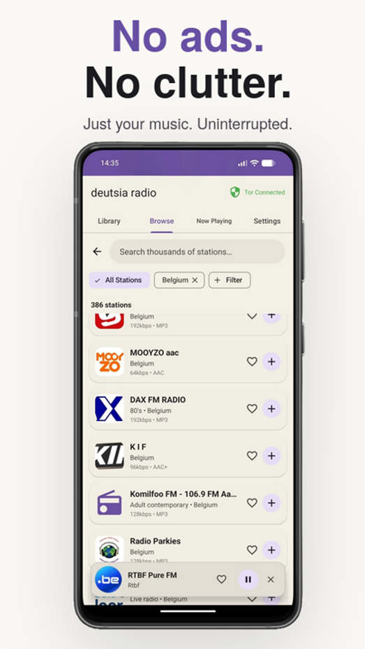

<div align="center">


<br></br>

# deutsia radio
[](https://github.com/deutsia/deutsia-radio/actions/workflows/build.yml)
[](https://github.com/deutsia/deutsia-radio/actions/workflows/test.yml)
[](https://github.com/deutsia/deutsia-radio/actions/workflows/trivy.yml)
[](https://securityscorecards.dev/viewer/?uri=github.com/deutsia/deutsia-radio)

Privacy-focused, censorship-resistant multinet radio player with Material You.

[ar](https://app.deutsia.com/ar/) | [de](https://app.deutsia.com/de/) | [es](https://app.deutsia.com/es/) | [fa](https://app.deutsia.com/fa/) | [fr](https://app.deutsia.com/fr/) | [hi](https://app.deutsia.com/hi/) | [it](https://app.deutsia.com/it/) | [ja](https://app.deutsia.com/ja/) | [ko](https://app.deutsia.com/ko/) | [my](https://app.deutsia.com/my/) | [pt](https://app.deutsia.com/pt/) | [ru](https://app.deutsia.com/ru/) | [tr](https://app.deutsia.com/tr/) | [uk](https://app.deutsia.com/uk/) | [vi](https://app.deutsia.com/vi/) | [zh](https://app.deutsia.com/zh/)

[](https://github.com/deutsia/deutsia-radio/releases/latest) &nbsp; [](https://github.com/ImranR98/Obtainium)

---

</div>

<div align="center">
    
    
    
</div>

---

## Updates
- **New Release: v1.6.5** Material 3 redesign, custom genre tagging, and Tor fallback for the Radio Registry API

---

## Features
- **Multinet Support** - Clearnet, I2P (.i2p), and Tor (.onion) with custom [Darknet API](http://api.deutsia.com) providing Tor/I2P stations
- **Force Tor Modes** - Proxy-or-fail enforcement with instant leak prevention
- **50,000+ Stations** - Access RadioBrowser API or add custom streams
- **Material You** - Dynamic theming along with 6 color schemes and Dark/Light mode
- **Stream Recording** - Record across multiple stations
- **App Lock** - Secure your listening with biometric/PIN protection and optional database encrpytion 
- **17 Languages** - Multilingual interface support
- **Add any station** Support for Tor, Clearnet, I2P and per-station level custom proxy stations
- **Full DNS Protection** - No DNS leaks to ISP/System DNS in Force Tor/Proxy modes, backed by 47 unit and integration tests
- **Disable API connections** - Completely disable API connections + external cover art and utilize the app with only your local library

---

## Privacy & Security

**Optional Database Encryption** via SQLCipher:
- All local data encrypted at rest (stations, settings, history)
- App lock with biometric/PIN protection
- Secure storage for favorites and playback data

**Credential Protection** via Android Jetpack Security:
- Proxy passwords encrypted with AES-256-GCM
- Hardware-backed encryption keys (when available)
- Secure credential storage for custom proxy authentication

**Tor Integration** via InviZible Pro SOCKS5 proxy:
- Instant disconnect detection (< 100ms)
- Fail-safe proxy enforcement - no clearnet fallback
- Automatic stream termination on proxy changes

**Force Tor Modes:**
- **Force Tor All** - Route everything through Tor
- **Force Tor Except I2P** - Tor for clearnet, I2P proxy for .i2p domains

**I2P Integration** via HTTP proxy (port 4444):
- Seamless .i2p domain routing
- Compatible with official I2P Android app

**Custom Proxies**
- Support for Digest and Basic auth
- Support for SOCKS4, SOCKS5, HTTP, and HTTPS proxies
- Force modes for maximum privacy

---

## Requirements
- Android 7.0 (API 24) or higher
- **For Tor:** [InviZible Pro](https://invizible.net) - Use **proxy mode** (not VPN mode) for best compatibility (click on the three dot menu in the upper right hand corner to switch). Proxy mode is easy to configure and allows running a separate VPN in the background if desired. Using Tor as a full device VPN will make I2P streaming almost impossible due to its latency. Other Android Tor proxy providers can also be used, InviZible Pro is recommended and simplest to set up. 
- **For I2P:** [I2P Android](https://geti2p.net/en/download) or [InviZible Pro](https://invizible.net) via i2pd

---

## Installation

Download the latest APK from the [Releases](https://github.com/deutsia/deutsia-radio/releases) page. A universal APK is provided that works on all supported devices (Android 7.0+).

You can also use [Obtainium](https://github.com/ImranR98/Obtainium) to keep the app updated automatically.

### Verifying the release (optional)

Releases are signed with [Sigstore](https://www.sigstore.dev/). To verify, download both the `.apk` and `.apk.sigstore` files from the same release, then run from the directory containing the downloaded files:

```bash
# Replace version number with the release you downloaded
cd ~/Downloads
cosign verify-blob \
  --bundle deutsia-radio-v1.6.5.apk.sigstore \
  --certificate-identity siewargottlichschon@gmail.com \
  --certificate-oidc-issuer https://github.com/login/oauth \
  deutsia-radio-v1.6.5.apk
```
---

## Tech Stack
- Kotlin + Material Design 3
- ExoPlayer (Media3) for audio
- OkHttp with SOCKS/HTTP proxy support
- Coil for proxy-aware image loading
- Room + SQLCipher for encrypted database

---

## Building

```bash
git clone https://github.com/deutsia/deutsia-radio.git
cd deutsia-radio
./gradlew assembleDebug
```

APK output: `app/build/outputs/apk/debug/`

Note: Java 21 (LTS) is required to build this project. Java 25+ is not yet supported by the Gradle/Kotlin toolchain. Set JAVA_HOME=/usr/lib/jvm/java-21-openjdk before building.

---

## FAQ

**Do I need Tor or I2P to use this app?**

No. Clearnet works on its own and gives you access to 50,000+ stations via the RadioBrowser API, like a normal radio app. Tor and I2P are completely optional for users who want privacy or access to darknet stations.

**How do I remain private/anonymous while using this app?**

By default, the app connects directly from your IP address. To stay anonymous, you need to enable a Force mode in settings and/or run a VPN in the background. There are several options depending on your setup:

- **Force Tor All:** Routes all traffic (streams, API calls, cover art) through Tor. Nothing touches the internet directly. If Tor disconnects, all traffic is blocked - there are no clearnet fallbacks. Try it yourself by disconnecting from Invizible Pro midstream while playing a clearnet station - the connection will not continue playing any more than what's left in the buffer.  
- **Force Tor Except I2P:** Routes clearnet traffic through Tor, but sends I2P traffic through the I2P HTTP proxy instead. This avoids the unnecessary latency of routing I2P over Tor.
- **Force Custom Proxy:** Routes all traffic through a proxy you configure (SOCKS4, SOCKS5, HTTP, or HTTPS). Useful if you run your own proxy or use a non-Tor proxy provider. 
- **Force Custom Proxy Except Tor/I2P:** Routes clearnet traffic through your custom proxy, while Tor and I2P stations use their native proxies.

For maximum privacy:
1. Enable a Force mode (Tor or Custom Proxy)
2. Disable the RadioBrowser API in settings if you don't need clearnet stations
3. Disable cover art loading if you want to eliminate all image requests
4. Enable database encryption to protect your local data at rest
5. Run a VPN in the background alongside InviZible Pro's proxy mode for an extra layer of protection if you don't fully trust the app or any of the APIs it connects to. Radio stations are low bandwidth, so most quality VPNs will still handle Tor and even I2P stations without issue.

All Force modes are fail-safe - if the proxy goes down, traffic is blocked, not leaked. This includes DNS leak prevention - in Force modes, all DNS queries are resolved through the proxy rather than your system/ISP DNS. 

***If you do not trust this app, run a trusted VPN in the background***

**Is there a darknet website to download this app?**
Yes. You can download anonymously via the I2P site:
`http://deutsiampy3y6z2gceje5llbi4vakzj67wamyjdqlzv2tines25q.b32.i2p/`

There is no clearnet or Tor mirror for the website. If you need to download over Tor, go to the [GitHub Releases](https://github.com/deutsia/deutsia-radio/releases) page using Tor Browser.

**Do clearnet stations block Tor in Force Tor mode?**
Sometimes, but rarely. The vast majority of clearnet stations do not block Tor.

**How do I import my stations from another app?**
Go to Settings and use the import option. Supported formats are CSV, JSON, M3U, and PLS.

**Why is cleartext traffic enabled in the manifest?**
I2P (`.i2p`) and Tor (`.onion`) sites use `http://` rather than `https://`. Cleartext traffic must be enabled for these domains to work.

**Why doesn't SOCKS4 fully protect my privacy like SOCKS5 and others?**

SOCKS4 does not support remote DNS resolution. When using Force Custom Proxy with a SOCKS4 proxy, DNS queries are resolved locally through your system/ISP DNS, which can leak the domains you're connecting to. SOCKS5 resolves DNS through the proxy itself, preventing these leaks. If DNS privacy matters to you, use SOCKS5, http, or https instead of SOCKS4 for your custom proxy. The app will show a warning when you select SOCKS4 as a reminder.

**What data does this app collect?**
None. All data (proxy passwords, stations, history, settings, favorites) is stored locally on your device. There is no cloud sync, no analytics, and no telemetry. You can optionally encrypt all local data with SQLCipher.

**Does cover art load through my proxy?**
Yes. When a Force mode is enabled, station artwork is routed through the same proxy pipeline as streams, with full DNS leak prevention. If the proxy disconnects, image loading is blocked rather than falling back to a direct connection.

**Can I use a different proxy instead of InviZible Pro?**
Yes. Any SOCKS5 proxy that routes through Tor will work. You can also configure a custom proxy (SOCKS4, SOCKS5, HTTP, or HTTPS) with optional authentication in the app's proxy settings.

**Does enabling Tor (non force mode) hide my IP?**
Not inherently. Without enabling a force mode, all clearnet traffic (streams, cover art) will be loaded from your direct IP. Enabling this non force mode just allows you to access Tor stations easily without going the extra mile of routing everything through Tor. 

**Does cover art load through my proxy?**
Yes. Station artwork is loaded through the same proxy pipeline as streams across all three networks (clearnet, I2P, and Tor). In Force modes, all image requests include full DNS leak prevention, DNS is resolved through the proxy, not your system resolver. If the proxy disconnects, image loading is blocked rather than falling back to a direct connection. You can also disable cover art entirely in settings to eliminate all image requests.

---

## Submit Stations

You can submit darknet stations (I2P/Tor) via the [Radio Registry API](https://api.deutsia.com).

Please note that you **cannot** submit clearnet stations here, even if they are part of a darknet website. If the stream source is not `.i2p` or `.onion`, please submit it to the [RadioBrowser database](https://www.radio-browser.info/add) instead.

---

## Support Development

**Monero (XMR):**
```
83GGx86c6ZePiz8tEcGYtGJYmnjuP8W9cfLx6s98WAu8YkenjLr4zFC4RxcCk3hwFUiv59wS8KRPzNUUUqTrrYXCJAk4nrN
```

---

##  Acknowledgments
- [RadioBrowser](https://www.radio-browser.info/) - Station database
- [InviZible Pro](https://invizible.net) - Tor/DNSCrypt/I2P integration
- [I2P Project](https://geti2p.net/) - Anonymous networking on Android
- Built with [Claude Code](https://github.com/anthropics/claude-code)
- [SQLCipher](https://www.zetetic.net/sqlcipher/) - Database encryption
- [Tor/I2P Station API](http://api.deutsia.com) - Tor/I2P API, open-sourced [here](https://github.com/deutsia/Radio-Registry-API)
---

## License

    deutsia radio

    Copyright (c) 2024 deutsia

    Licensed under the Apache License, Version 2.0 (the "License");
    you may not use this file except in compliance with the License.
    You may obtain a copy of the License at

        http://www.apache.org/licenses/LICENSE-2.0

    Unless required by applicable law or agreed to in writing, software
    distributed under the License is distributed on an "AS IS" BASIS,
    WITHOUT WARRANTIES OR CONDITIONS OF ANY KIND, either express or implied.
    See the License for the specific language governing permissions and
    limitations under the License.

---

<div align="center">
    
    
    
</div>
