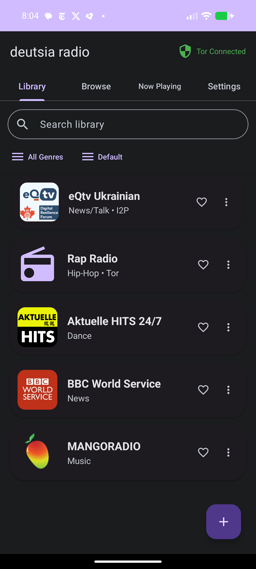
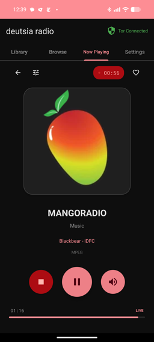
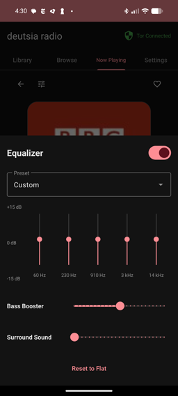
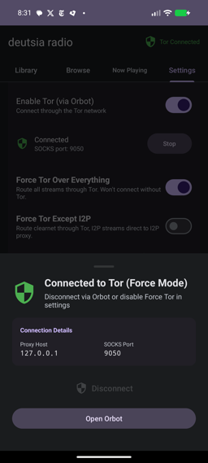
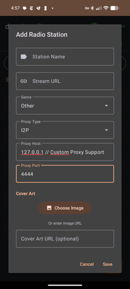
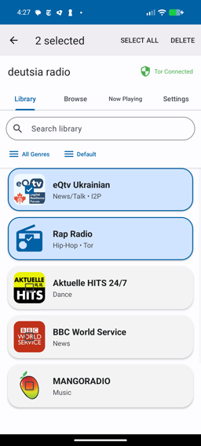
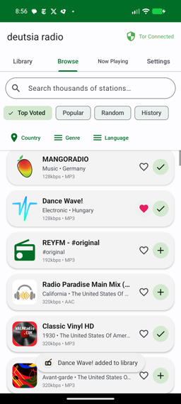
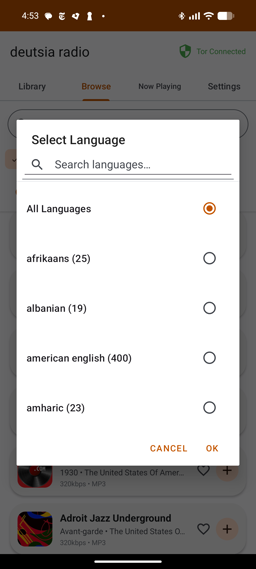

# deutsia radio
A privacy-focused, anti-censorship multinet radio player built with Claude Code. Stream radio stations from clearnet, I2P, and Tor networks with advanced anonymity features.

## Features

- 50,000+ radio stations via RadioBrowser API
- Custom station support (add any stream URL)
- Clearnet, I2P (.i2p), and Tor (.onion) network support
- Force Tor modes with fail-safe leak prevention
- Per-station proxy configuration (Tor SOCKS5, I2P HTTP, custom)
- Instant Orbot broadcast detection (< 100ms disconnect response)
- Automatic stream termination on proxy changes
- Stream recording with file management
- Material You dynamic theming (Android 12+)
- 5 color schemes (Blue, Peach, Green, Purple, Orange)
- Light/Dark/System theme modes
- No tracking, analytics, telemetry, or ads
- Open source

  

## Tor Integration

deutsia radio integrates with Orbot (the official Tor client for Android) via SOCKS5 proxy on port 9050. The integration uses three layers of protection:

**1. Instant Orbot Broadcasts**
Orbot sends immediate STATUS_ON/STATUS_OFF broadcasts when it starts or stops. The app registers a BroadcastReceiver that responds in under 100ms. When Orbot stops, the app receives STATUS_OFF instantly and updates state immediately.

**2. Fail-Safe Proxy Enforcement**
When Force Tor is enabled, all connections use an explicit SOCKS5 proxy configuration. If the Tor proxy becomes unreachable, OkHttp connection attempts FAIL immediately - there is no clearnet fallback. The proxy is enforced at the network layer: `Proxy(Proxy.Type.SOCKS, InetSocketAddress(host, 9050))`. If this socket is unreachable, the connection throws an exception.

**3. Health Checks (Backup)**
Every 30 seconds, a socket connection test runs against 127.0.0.1:9050. If this fails while the app thinks Tor is connected, it updates the UI to show disconnected. This catches silent failures where Orbot crashes without broadcasting.

### Installation

1. Install Orbot from F-Droid or Google Play
2. In deutsia orbot Settings, enable "Tor (via Orbot)" toggle
3. In Orbot "Start" to connect to Tor
4. Wait for "Connected" status

Orbot provides the Tor daemon - deutsia radio connects to it as a client. Note: deutsia radio connects to Orbot at the application level. This means that unless you've configured Orbot to be a full device VPN, your connection to other apps like Spotify or Chrome will be from your residential ip address. 

## Force Tor Protection

Force Tor modes ensure all traffic routes through Tor with multiple layers of leak prevention.

**Force Tor All**
Routes everything through Tor SOCKS5 proxy:
- Radio streams
- RadioBrowser API metadata requests
- Album art downloads
- All HTTP traffic

**Force Tor Except I2P**
Routes clearnet through Tor, I2P streams through I2P proxy:
- Clearnet streams → Tor (127.0.0.1:9050)
- .i2p domains → I2P HTTP proxy (127.0.0.1:4444)
- RadioBrowser API → Tor
- Album art → Tor (local art loaded locally)

### How Force Tor Protects You

When Force Tor is enabled and Tor disconnects, your traffic does not leak to clearnet. Here's how:

**Instant Detection via Orbot Broadcasts**
Orbot broadcasts STATUS_OFF immediately when it stops. The app receives this broadcast (line 336-340 in TorManager.kt), updates state to STOPPED, and the next stream chunk request sees Tor is unavailable.

**Proxy-or-Fail Enforcement**
The app configures OkHttp with an explicit proxy: `Proxy(Proxy.Type.SOCKS, InetSocketAddress("127.0.0.1", 9050))`. When this proxy is unreachable, OkHttp throws a connection exception. There is no fallback to direct connection - the connection simply fails.

**Automatic Stream Stopping**
When you toggle Force Tor settings, the app automatically stops the current stream (line 1347 in RadioService.kt). You must restart playback manually. This prevents old routing from persisting.

**Health Check Backup**
Every 30 seconds, a socket test connects to 127.0.0.1:9050 with a 2-second timeout (line 161 in TorManager.kt). If this fails while state is CONNECTED, the UI updates to show ERROR. This catches crashes where Orbot fails to broadcast.

**Separate Recording Protection**
Recording uses a completely separate OkHttp client instance (buildRecordingHttpClient, line 1011). Force Tor settings apply to recording traffic identically - if Tor disconnects, recording connections also fail.

### The Two Protection Mechanisms

**Instant Orbot Broadcasts (Primary)**
- Orbot sends STATUS_OFF when stopping
- App receives broadcast in < 100ms
- State updates immediately
- Next stream chunk sees Tor unavailable

**30-Second Health Check (Backup)**
- Socket test runs every 30 seconds
- Detects silent crashes (no broadcast)
- Updates UI if proxy unreachable
- Independent verification layer

The broadcast is instant. The health check is a backup for edge cases where Orbot crashes without broadcasting.



## I2P Integration

I2P streams (.i2p domains) use an HTTP proxy on port 4444.

**Setup**
1. Install I2P for Android from wherever you get your apps (F-droid: https://f-droid.org/en/packages/net.i2p.android.router/) 
2. Start I2P and wait for it to show "I2P HTTP Proxy" under tunnels ~50s
3. Choose a custom I2P radio station to play or import I2P station list from Settings
5. Stations with .i2p URLs automatically use the I2P proxy

When Force Tor Except I2P is enabled, .i2p streams bypass Tor and use the I2P proxy directly. All other traffic goes through Tor.

## Custom Proxies

You can configure custom proxies per-station:

**Supported Types**
- SOCKS5 (Tor-compatible)
- HTTP (I2P-compatible)
- Direct (no proxy)

**Configuration**
1. Add or edit a station
2. Set proxy type to I2P
3. Set proxy host (e.g., 127.0.0.1)
4. Set proxy port (e.g., 9050 for Tor, 4444 for I2P)

The app enforces the proxy at the OkHttp client level. Custom proxies are not affected by Force Tor modes unless you're using the "force Tor over everything" setting.



## FAQ

**What happens if Tor dies?**

```
Scenario 1: Normal shutdown
Time 0s   - Tor connected, streaming
Time 5s   - Orbot stops
Time 5s   - Orbot broadcasts STATUS_OFF → App stops immediately
Time 5s   - Next stream chunk tries to connect → SOCKS proxy unreachable → Fails
Result    - No leak, instant detection

Scenario 2: Orbot crashes (no broadcast)
Time 0s   - Tor connected, streaming
Time 5s   - Orbot crashes without broadcasting
Time 5s   - Next stream chunk tries SOCKS proxy → Unreachable → Connection FAILS
Time 35s  - Health check detects failure, updates UI
Result    - No leak, connection fails immediately, UI updates within 30s

Scenario 3: You toggle Force Tor
Time 0s   - Streaming with old proxy settings
Time 1s   - You toggle Force Tor mode
Time 1s   - App automatically STOPS current stream
Time 1s   - Must manually restart with new settings
Result    - No leak, forced re-connection
```

**Does Force Tor slow down streams?**

Yes. Tor adds some latency when intially loading streams. It's quite negliable and there is no difference in experience from using clearnet to load streams once a radio is loaded.

**Can I use Force Tor with I2P stations?**

Yes. Use "Force Tor Except I2P" mode. This routes clearnet through Tor but lets .i2p domains use the I2P proxy directly. Force Tor All routes everything through Tor, which breaks I2P streams.

**What if I don't have Orbot installed?**

Force Tor modes require Orbot. If Orbot is not installed, Force Tor settings will block stream playback. However, you can access Tor stations and browse clearnet radios from Tor using alternative Tor device vpns like InviZible Pro. 

**How do health checks work?**

Every 30 seconds (when Tor is connected), the app opens a socket to 127.0.0.1:9050 with a 2-second timeout and immediately closes it. If this fails, Tor is unreachable. This is separate from Orbot broadcasts and provides redundant verification.

**Why separate recording connections?**

Recording uses a completely separate OkHttp client instance to prevent interference with playback. The recording client has its own connection pool, dispatcher, and proxy configuration. This ensures recording cannot cause audio glitches.

**Do clearnet stations block Tor requests?**

Not that I personally know of, although I am sure some do. If you find a station that isn't loading it's more likely the station is down, rather than your being blocked. If you think that's not the issue, try setting a new identity within Orbot, or disabling Tor. 

## Requirements

- Android 7.0 (API 24) or higher
- For Tor: Orbot app
- For I2P: official I2P app (recommended) or Invizlble Pro (i2pd) 

## Tech Stack

- Kotlin
- Material Design 3
- ExoPlayer (Media3)
- Room database
- OkHttp (SOCKS/HTTP proxy support)
- Coil (proxy-aware image loading)
- Orbot integration via SOCKS5

## Building

```bash
git clone https://github.com/deutsia/deutsia-radio.git
cd deutsia-radio
./gradlew assembleDebug
```

APK output: `app/build/outputs/apk/debug/`

## Security Notes

Force Tor modes enforce proxy-or-fail at the network layer. If Tor disconnects, connections fail rather than leak. However:

- You must configure Orbot correctly
- Always verify Tor connection is active
- This app is not complete anonymity, always use proper OpSec
- Network-level leaks (DNS, WebRTC) are outside app scope

## Screenshots
    
## License

Apache License 2.0 - see the [LICENSE](LICENSE) file for details

## Acknowledgments

- [RadioBrowser](https://www.radio-browser.info/) for station database
- [Orbot](https://guardianproject.info/apps/org.torproject.android/) for Tor integration
- [I2P Project](https://geti2p.net/) for anonymous networking and android support
- Built with [Claude Code](https://github.com/anthropics/claude-code)

## Support

**Monero (XMR):**
```
83GGx86c6ZePiz8tEcGYtGJYmnjuP8W9cfLx6s98WAu8YkenjLr4zFC4RxcCk3hwFUiv59wS8KRPzNUUUqTrrYXCJAk4nrN
```
